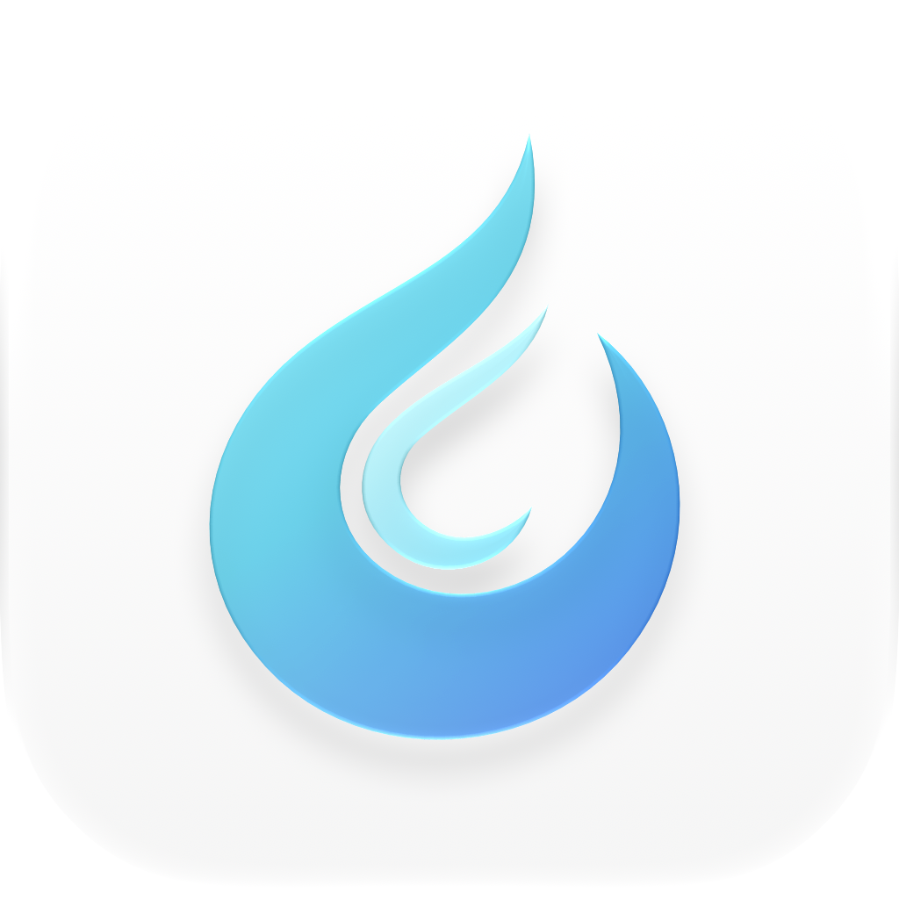

<div align="center">
  
  <h1>HyprSpace</h1>
  <p>Hyprland-inspired tiling and window groups for macOS.</p>
  <p>
    <a href="legal/LICENSE.txt"></a>
    <a href="#install"></a>
    <a href="dev-docs/development.md"></a>
    <a href="https://github.com/Li-RC/HyprSpace/releases/latest"></a>
    <a href="https://github.com/Li-RC/HyprSpace/releases"></a>
    <a href="https://github.com/Li-RC/HyprSpace/actions/workflows/build.yml"></a>
  </p>
  <p>
    <a href="https://github.com/Li-RC/HyprSpace/releases/latest">Download</a> ·
    <a href="#configuration">Configuration</a> ·
    <a href="dev-docs/development.md">Build from source</a> ·
    <a href="legal/LICENSE.txt">MIT license</a>
  </p>
</div>

HyprSpace is a keyboard-driven tiling window manager for macOS, built on [AeroSpace](https://github.com/nikitabobko/AeroSpace), with Hyprland-inspired dwindle tiling, tabbed window groups, and an integrated workspace strip.

## Features

- **Dwindle tiling:** new windows split the focused tile; split directions stay fixed as you work.
- **Window groups:** keep several windows in one tile, switch members with tabs or shortcuts, and drag tabs to reorder them.
- **Workspace strip:** switch workspaces and focus apps directly from the menu bar. The overview includes individual windows and optional Dock unread badges.
- **Window borders:** configurable active and inactive colors, with native glass group bars on supported macOS versions.
- **Ten workspaces:** the new default config provides workspaces 1–10, keyboard navigation, resizing, grouping, and floating/fullscreen toggles.
- **Multi-monitor support, TOML configuration, and a CLI:** retains AeroSpace's workspace model and command compatibility without requiring SIP to be disabled.

## Install

Download the DMG from [HyprSpace releases](https://github.com/Li-RC/HyprSpace/releases/latest). Quit any running AeroSpace or HyprSpace instance, open the DMG, and drag **HyprSpace.app** to **Applications**. Launch it and grant Accessibility permission when prompted.

The v0.1.0 release includes universal binaries for Apple Silicon and Intel, with a macOS 13.0 deployment target. Releases are ad-hoc signed and not notarized. If macOS blocks an app you downloaded from this repository, review it in **System Settings → Privacy & Security**.

The ZIP also includes the `aerospace` command-line client, configuration examples, and license files. Place `bin/aerospace` on your `PATH` if you want to use the CLI. SHA-256 checksum files accompany the downloads.

There is no HyprSpace Homebrew tap currently. The upstream AeroSpace cask installs AeroSpace, not HyprSpace.

## Configuration

HyprSpace retains these config paths for compatibility:

1. `~/.aerospace.toml`
2. `${XDG_CONFIG_HOME:-~/.config}/aerospace/aerospace.toml`

Use one location. An existing config takes priority over the bundled default and is never automatically replaced. In particular, existing keybindings do not gain the new shortcuts automatically.

The [bundled default](docs/config-examples/default-config.toml) enables dwindle, grouping shortcuts, borders, and ten workspaces. The refreshed v0.1.0 downloads include this default. If you downloaded the original v0.1.0 build, download it again to get the updated app, or use the [HyprSpace example](docs/config-examples/hyprspace-dwindle.toml).

For a fresh configuration on a build with the new default:

```sh
mkdir -p ~/.config/aerospace
cp /Applications/HyprSpace.app/Contents/Resources/default-config.toml ~/.config/aerospace/aerospace.toml
aerospace reload-config
```

Back up an existing config before replacing it. Custom integrations and app rules belong in your personal config. Enable launch at login with `start-at-login = true`.

## Default shortcuts

| Shortcut | Action |
| --- | --- |
| Ctrl + H/J/K/L | Focus left/down/up/right |
| Ctrl + Shift + H/J/K/L | Move the window or group |
| Ctrl + − / = | Resize the current tile |
| Ctrl + F | Toggle HyprSpace fullscreen |
| Ctrl + Shift + F | Toggle floating/tiling |
| Ctrl + 1–9 / 0 | Switch to workspace 1–9 / 10 |
| Ctrl + Shift + 1–9 / 0 | Move to workspace 1–9 / 10 |
| Ctrl + G | Toggle grouping for the focused window |
| Ctrl + Tab / Ctrl + Shift + Tab | Next/previous group member |
| Ctrl + Shift + G | Remove the active member from its group |
| Ctrl + Shift + Arrow | Join the neighboring tile's group |
| Ctrl + Shift + R | Reload configuration |

HyprSpace fullscreen is separate from macOS native fullscreen. Directional focus needs an eligible neighboring tile; grouping needs a tiled window and dwindle enabled. macOS Secure Input can prevent global shortcut delivery.

## Documentation

- [Configuration and workspace guide](docs/guide.adoc)
- [CLI commands](docs/commands.adoc) — command names remain `aerospace`
- [Dwindle, groups, borders, and dragging](dev-docs/hyprspace-dwindle.md)
- [Integrated workspace status](docs/hyprspace-workspace-status.md)
- [Development and release builds](dev-docs/development.md)

## Feedback and contributing

Report HyprSpace bugs and feature requests in [this repository's issues](https://github.com/Li-RC/HyprSpace/issues). Include the app version, macOS version, relevant config, and reproduction steps. See [CONTRIBUTING.md](CONTRIBUTING.md) for development guidance.

## Credits and license

HyprSpace is an independent fork of [AeroSpace by Nikita Bobko and contributors](https://github.com/nikitabobko/AeroSpace). Its dwindle layout and grouping workflows are inspired by [Hyprland](https://github.com/hyprwm/Hyprland); HyprSpace is not an official Hyprland project.

The integrated Workspace Status components retain their [MIT license](legal/workspace-status/LICENSE). See [legal/README.md](legal/README.md) for the project license and bundled dependency notices.
